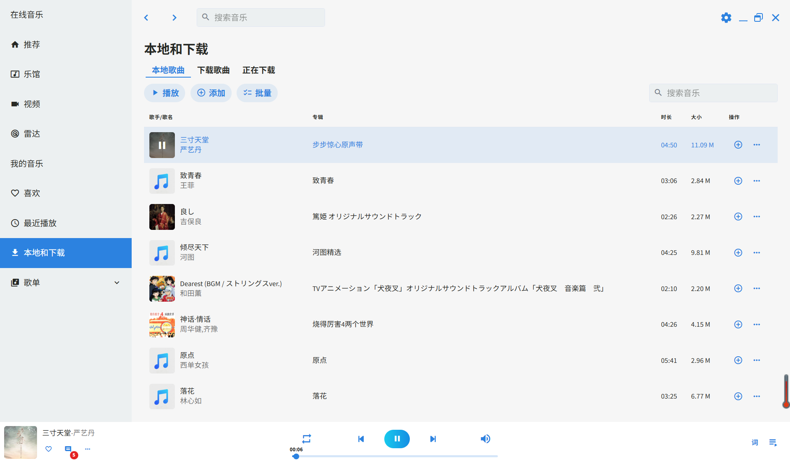

# MYMUSIC

> 一款基于Vue3 + ts + vite + Electron的桌面音乐播放器应用，仿qq音乐

## 开发语言

- 本项目采用Vue3框架 + Typescript语言 + Electron进行开发，支持客户端
- 使用UI组件库为Vuestic
- 使用pinia为全局状态管理工具

## 功能

- [x] 支持音乐暂停和播放，切换上一首和下一首
- [x] 支持随机播放、单曲循环、循环播放
- [x] 支持倍速
- [ ] 在线音乐播放

## 功能界面
> 后端正在开发中，目前只开发了前端本地音乐部分
- 本地音乐主页面

